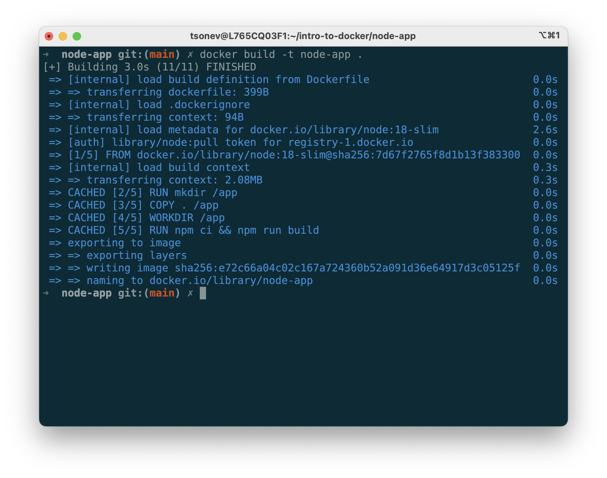
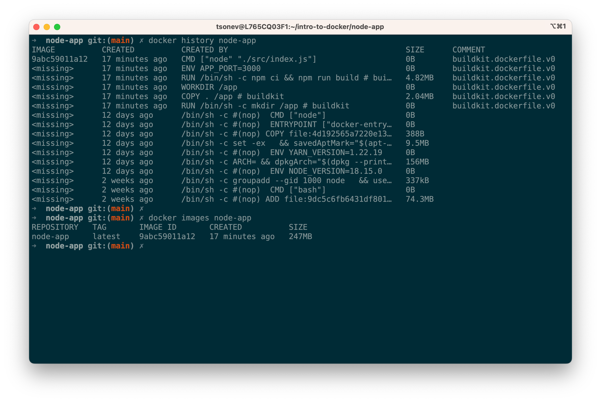
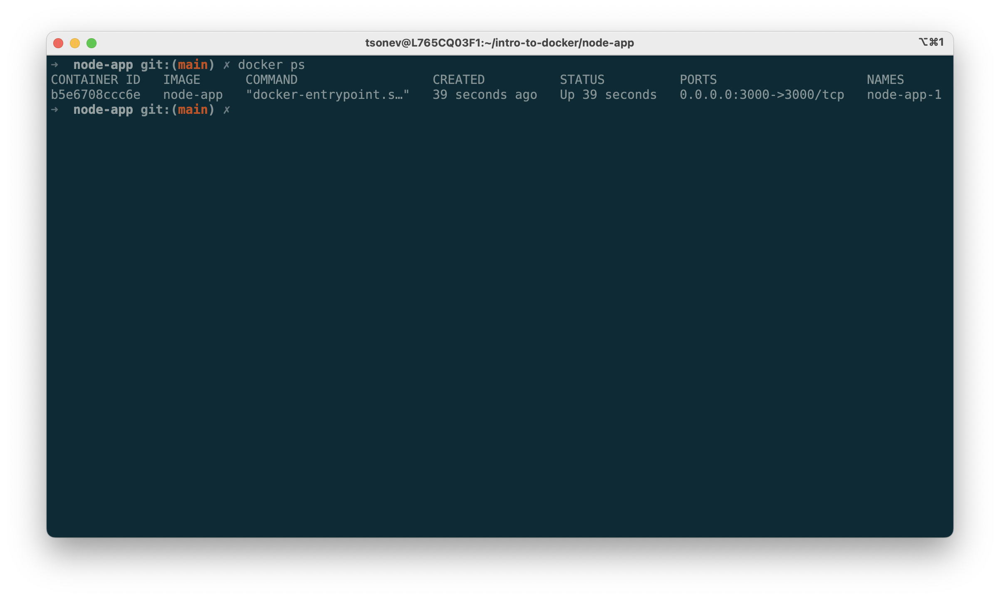

# **Intro to Docker**

&nbsp;

---
# **Intro to ~~Docker~~ Containers**

As made popular by Docker

---
# A container...

- *Is not* a Virtual Machine
- *Does not* have an Operating System

---
# A container...

- *Is* a Virtual Environment
- *Is* running on the host Operating System

---
# Containers are Great

- For building applications
- For shipping applications
- For development environments

---
# Containers are Not So Great

- For security isolation

---
# A history note

- It didn't all start with Docker
- It didn't even start in this century :)
- Unix has had `chroot` since Forever 🦖
- FreeBSD introduced Jails in 2000
- Linux Containers (LXC) shipped in 2008

---
# Then Docker came along...

- And **nailed it** with ease of use
- Everyone can *use containers*
- Everyone can *make containers*
- Everyone can *share containers*
- Even on Mac and Windows

---
# Docker on Mac and Windows

- Linux containers run in a VM managed by Docker
- Performance is not great, but adequate

---
# Native Windows Containers

- A closed ecosystem
- A bit late to the party
- Supported by Docker Desktop (kind of)
- Not covered in this talk

---
# Docker Desktop

- Recommended on Mac and Windows
- Free for personal use and educational purposes
- Requires a subscription if you use it for business

---
# Alternatives to Docker

- Podman is a drop-in replacement for Docker Engine
- Podman is not a complete replacement for Docker Desktop

--
https://podman.io/getting-started/installation

---
# Glossary

- Dockerfile describe the steps to build a container
- Building the Dockerfile produces an image
- Images are immutable
- Images can be shared publicly or privately
- You can run multiple instances from the same image

---
# Let's Build a Container Image

- Demo: Build and run a Node.JS application

==Video of the app==

https://github.com/tsvetomir/presentations/tree/main/intro-to-docker/node-app

---
# Anatomy of a Dockerfile

- Use official Node.js 18 image as base
    ```Dockerfile
    FROM node:18-slim
    ```
- Copy the application source in `/app`
    ```Dockerfile
    RUN mkdir /app
    COPY . /app
    ```
- Install dependencies
    ```Dockerfile
    WORKDIR /app
    RUN npm ci && npm cache clean -f
    ```
- Configure and run app
    ```Dockerfile
    ENV APP_PORT=3000
    CMD ["node", "index.js"]
    ```

---
# Build the Image

- Choose a name and run:
  `docker build -t node-app .`
- Image is now stored on your computer
- Can be published to a registry


--
https://docs.docker.com/engine/reference/commandline/build/

---
# Layers

- Each `COMMAND` creates a layer
- A layer is a snapshot of the file system
- Layers are cached and shared between builds
- Extra layers can increase image size
  `RUN npm ci && npm cache clean -f`
- To see all image layers, run:
  `docker history node-app`



---
# Container lifecycle

- Create a container instance
  `docker create` or `docker run`
- Start / Stop a container
  `docker start` / `docker stop`
- Pause / Unpause a container
  `docker pause` / `docker unpause`
- Delete a container
  `docker rm`
- List containers
  `docker ps`



---
# Running the Container

- Create and run
  `docker run -d --init -p 3000:3000 --name node-app-1 node-app`
- Create, run and remove on exit
  `docker run --rm --init -it -p 3000:3000 node-app`

---
# .NET Core containers

- Demo: .NET Core App

==Dockerfile Screenshot==

---
# Multi-stage builds

==Anatomy of a Dockerfile==

---
# Accessing files outside the container

- Demo: Look, no Dockerfile!

---
# Tips & Tricks for Images

  - Prefer official images for common software stacks
  - Otherwise, use Debian Linux as base
  - Don't worry too much about image size

---
# Poll - Next Topics

- Containers in GitHub Actions
- Deploying Container Apps
- VS Code Development Containers
- Windows Containers

---
# Bonus: Debug a build

- Demo: Teaser (Act)